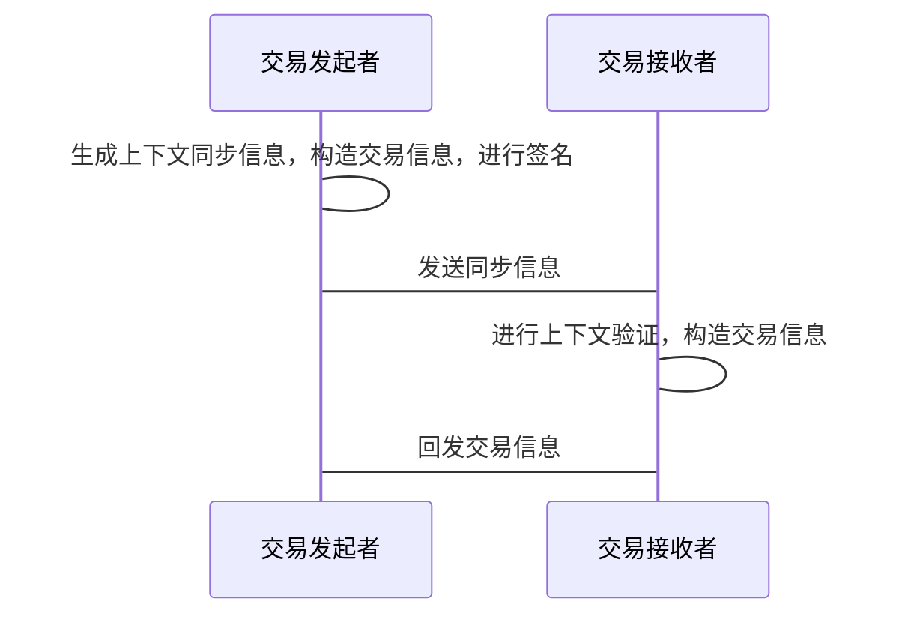

# Transaction

交易管理模块

## 交易协议

### 简单单方交易

即A状态转移单方面给B。

```mermaid
sequenceDiagram
  participant a as 交易发起者
  participant b as 交易接收者

  a -> a: 生成上下文同步信息，构造交易信息，进行签名
  a -> b: 发送同步信息
  b -> b: 进行上下文验证，构造交易信息
  b -> a: 回发交易信息
```

#### 数据结构

### 多方交易协议

交易多方可以进行聚合交易

TODO:

### 数据库结构

