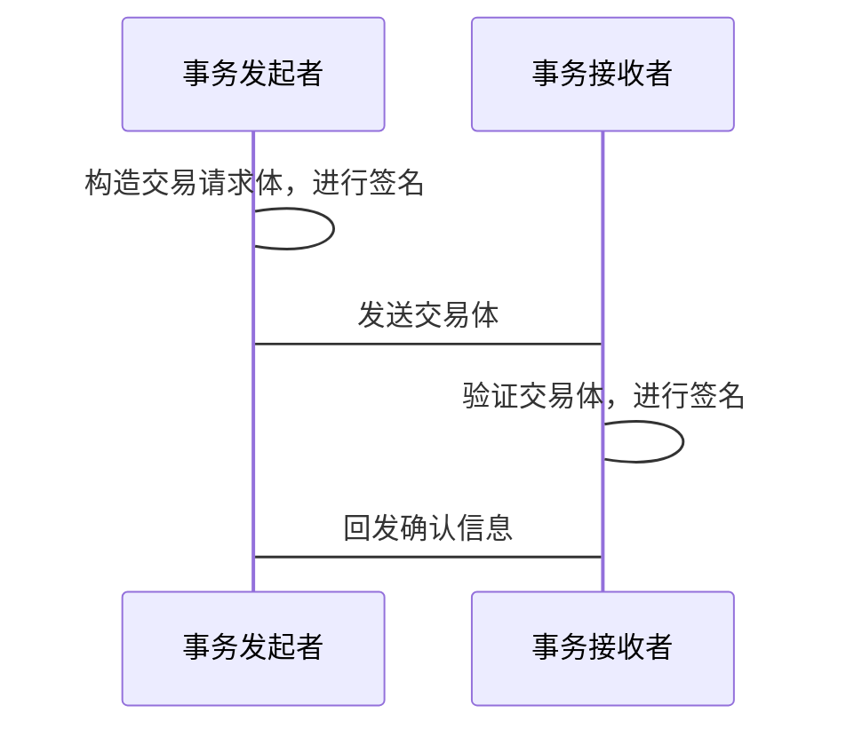

# Transaction

事务管理模块

事务指的是对状态进行修改的原子操作。

## 数据结构

```protobuf
syntax = "proto3";

// Input of transaction.
message TranscationInput {
  bytes arguments = 1; // use these arguments to verify contract.
  SignedState state = 2;
}

// Output of transaction.
message TranscationOutput {
  uint64 size = 1; // Size of state.
  bytes state = 2; // State data.
  bytes owner = 3; // Owner's cert
  bytes lock = 4; // Smart contract support.
  bytes valid = 5; // Valid script. Use this script to valid this state.
}

// Signed Transaction
message Transaction {
  sint64 timestamp = 1;
  repeated TranscationInput inputs = 2;
  repeated TranscationOutput outputs = 3;
}

```

## 协议

### 单方简单事务

即A状态转移单方面给B，A直接完成交易体。



### 双方简单事务

### 多方交易协议

交易多方可以进行聚合交易

TODO:

### 数据库结构

TODO:

### RPC接口

- list_txs
- get_tx
- send_tx
- send_raw_tx
